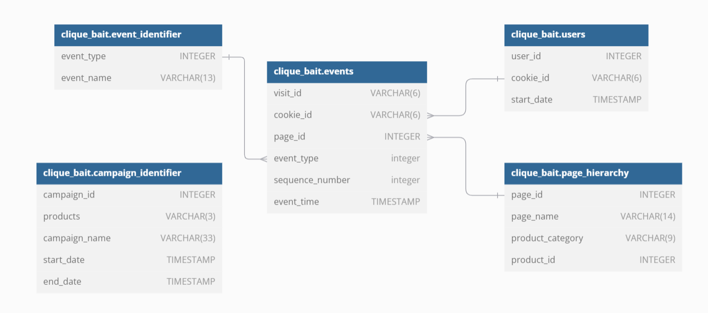

# Clique Bait Case Study

## Business Task
Clique Bait is not like your regular online seafood store - the founder and CEO Danny, was also a part of a digital data analytics team and wanted to expand his knowledge into the seafood industry!

In this case study - you are required to support Danny’s vision and analyse his dataset and come up with creative solutions to calculate funnel fallout rates for the Clique Bait online store.

---

## Entity Relationship Diagram

---

## 1. Digital Analysis

View my solution here

Using the available datasets - answer the following questions using a single query for each one:

How many users are there?
How many cookies does each user have on average?
What is the unique number of visits by all users per month?
What is the number of events for each event type?
What is the percentage of visits which have a purchase event?
What is the percentage of visits which view the checkout page but do not have a purchase event?
What are the top 3 pages by number of views?
What is the number of views and cart adds for each product category?
What are the top 3 products by purchases?